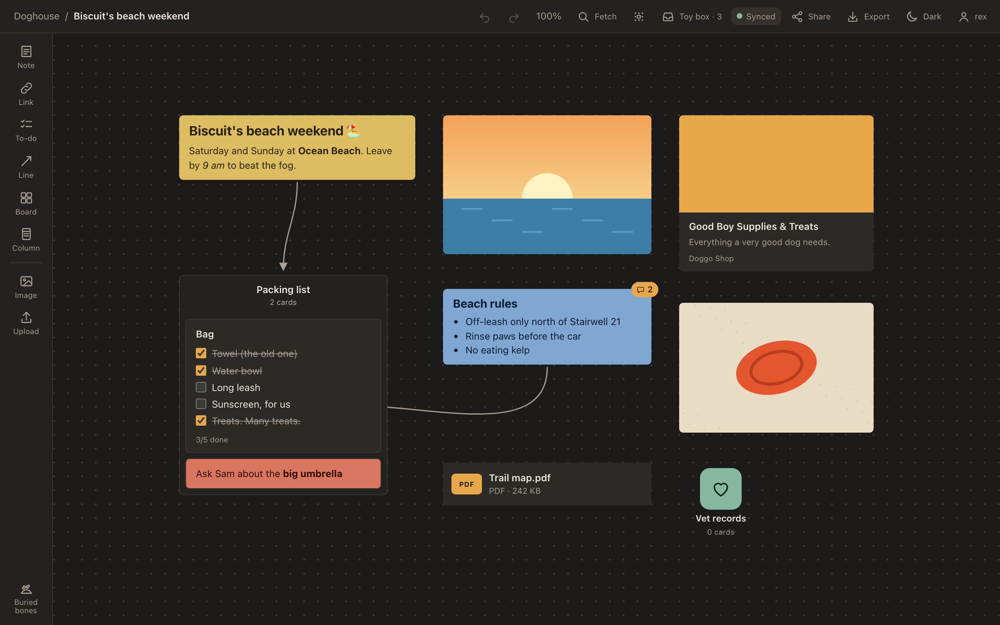
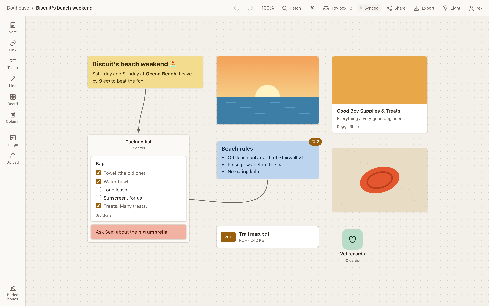
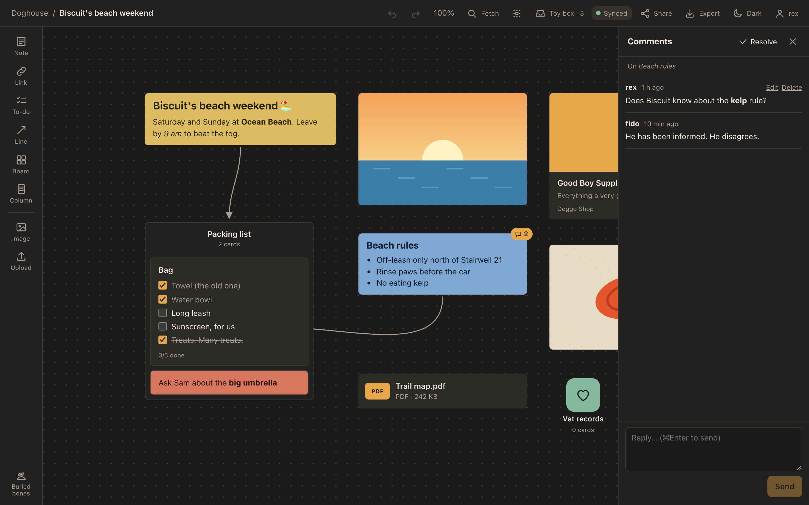
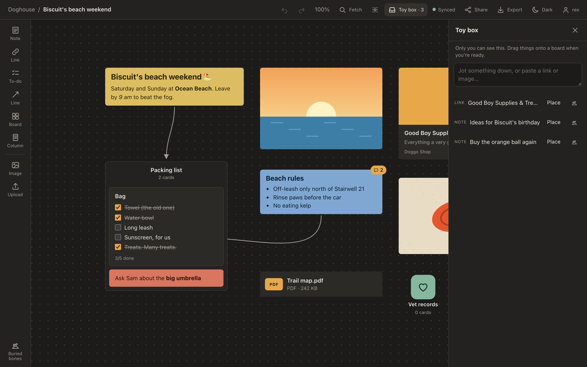
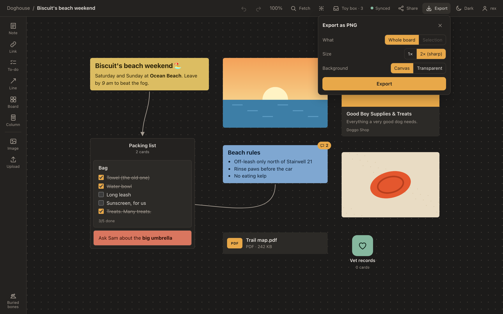

<p align="center">
  
</p>

<h1 align="center">DoggyNote</h1>

<p align="center">
  A fast, cosy, dog-themed board app for collecting ideas. A self-hosted Milanote for a few friends.<br>
  <a href="https://notepad.dog"><b>notepad.dog</b></a> · <a href="https://notepad.dog/api/desktop/download">Download for Mac</a>
</p>

<p align="center">
  
</p>

DoggyNote is an infinite canvas for notes, to-do lists, images, links and files. You arrange them freely, group them into columns, nest boards inside boards, and draw lines between them. It's built for a handful of people sharing one server. It runs as a native Mac app, and anyone can view a board you share in their browser.

It's designed to stay fast on big boards. The Mac app is a small native app (about 13 MB), not a bundled copy of Chrome. A board with a thousand cards and hundreds of images pans at a steady 60 fps.

## Features

**On the board**
- **Notes in Markdown** with live preview: headings, bold, lists, checklists and links render as you type.
- **To-do lists**, **columns** that cards snap into, and **boards inside boards** with icons and colours.
- **Images**: paste, drop or upload. Several sizes are stored, so zoomed-out boards stay light.
- **Links** unfurl into previews with title, description and image.
- **Files** up to 50 MB (PDFs, docs, zips…). PDFs show their first page.
- **Connectors** between cards, snapping to the middle of each side.
- **Dot grid and snap to grid** (⌘'): cards land on the grid when you move or resize them, with a trackpad tick in the Mac app.
- **Colours**, multi-select, undo/redo, and **Buried bones** (trash) to dig things back up.
- **Fetch** (⌘K) searches every board.

**Working together**
- **Live sync** between people and devices, merged field by field, so two people editing different parts of a card don't overwrite each other.
- **Works offline.** Edits wait on your device and sync when you're back.
- **Comment threads** on any card: replies, resolve/reopen, and edit or delete your own messages.
- **View-only share links**: anyone can look, nobody can edit. Turn a link off at any time.

**Just for you**
- **Toy box**: a private inbox only you can see. Jot something down now and drag it onto a board later. Privacy is enforced by the server, not just hidden in the app.
- **Quick capture** (⌃⌥Space in the Mac app): a little window from anywhere that drops a thought, link or image into your Toy box.

**Getting things out**
- **Export as PNG**: the whole board or a selection, at 1× or 2×, on the canvas colour or a transparent background.

**Look and feel**
- **Light and dark themes** (or follow the system). Every colour pair is tested for readable contrast.
- **Mildly dog-themed**: a paw cursor, a wagging-tail loader, a Doghouse home board and Buried bones.
- **The Mac app updates itself.** Browsers get a "new version" toast.

## Screenshots

| | |
|---|---|
|  |  |
| **Light theme** | **Comment threads** on any card |
|  |  |
| **Toy box**, your private inbox | **Export** a board or selection as PNG |

## Getting it

- **Mac app:** [download the latest version](https://notepad.dog/api/desktop/download), open the disk image and drag DoggyNote to Applications. It's signed with our own certificate rather than an Apple one, so the first launch needs right-click → **Open**. After that it updates itself.
- **Browser:** sign in at [notepad.dog](https://notepad.dog).
- **Accounts:** there's no public sign-up. An admin adds people from the account menu.

## How it's built

| Part | What |
|---|---|
| `apps/web` | The canvas app and the read-only share viewer. SolidJS + Vite, plain DOM cards, a canvas overview when zoomed far out |
| `apps/desktop` | The Mac app: a Tauri 2 shell around the web app (Keychain sign-in, global shortcut, native save dialog, auto-update) |
| `apps/server` | A Cloudflare Worker (Hono) with D1 (SQLite) for boards and R2 for images and files. Runs on the free tier |
| `packages/core` | Pure TypeScript shared by app and server: geometry, connectors, undo, Markdown parsing |
| `packages/theme` | Colour tokens for both themes, contrast tests, and the dog-themed wording |

### Development

```bash
pnpm install
pnpm --filter server e2e:serve    # local Worker with test users rex / goodboy123 and fido / fetchfetch
pnpm dev                          # web app on http://localhost:5173
pnpm --filter desktop dev         # the Mac app against the dev server

pnpm test                         # unit tests
pnpm test:e2e                     # Playwright end-to-end tests, WebKit + Chromium
```

Every pull request runs typecheck, unit tests, the full end-to-end suite on WebKit and Chromium, and a performance check. Merging to `main` deploys the server and web app and publishes a signed Mac build that installed apps pick up on their own. [`CLAUDE.md`](CLAUDE.md) holds the project's rules: colours, performance, privacy and API compatibility.

The screenshots above come from a seeded demo board. To regenerate them, run `SHOTS=1 pnpm --filter web exec playwright test readme-shots --project=chromium`.
